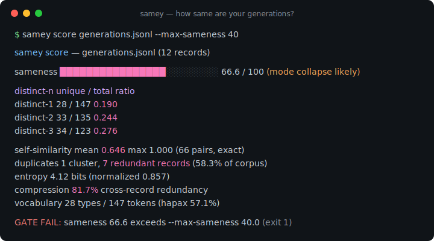
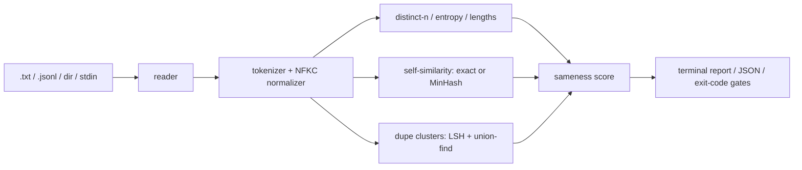

# samey

[English](README.md) | [中文](README.zh.md) | [日本語](README.ja.md)

[](LICENSE) [](CHANGELOG.md) [](pyproject.toml)  [](CONTRIBUTING.md)

**生成テキストの多様性を測るオープンソースのメトリクスツール — distinct-n・自己類似度・重複クラスタを 0-100 の sameness（同質度）スコアに集約。**



```bash
git clone https://github.com/JaydenCJ/samey && cd samey && pip install -e .
```

> **プレリリース：** samey はまだ PyPI に公開されていません。最初のリリースまでは [JaydenCJ/samey](https://github.com/JaydenCJ/samey) をクローンし、リポジトリのルートで `pip install -e .` を実行してください。

## なぜ samey？

合成データ生成は爆発的に普及しましたが、誰も予算に入れていない失敗モードが「同質化」です。サンプラーが静かに収束し、何千件もの「新しい」レコードが実はスロットを 1 つ差し替えただけの同一テンプレートになり、トークン課金で買ったデータが学習を少数のモードへ偏らせます。既存のツールは、データセットを書き換える重複除去*パイプライン*か、メトリクス設計を利用者に丸投げする類似度*ライブラリ*か、モデルを評価するのにモデルが要る評価ハーネスのどれかです。samey は意図的に小さく作られています。出力ファイルに向けるだけの読み取り専用 CLI が、*これらはどれだけ同じか？* という一つの問いに、パイプラインのゲートに直結できる数値で答えます。何も生成せず、何も削除せず、API も呼ばず、依存もゼロです。

|  | samey | text-dedup | datasketch | vendi-score |
|---|---|---|---|---|
| 出力ファイルの多様性レポートをコマンド一発で | Yes | No（重複除去パイプライン） | No（LSH ライブラリ） | No（Python ライブラリ） |
| レコード番号つきの重複クラスタを報告 | Yes | 削除が目的 | 自分で組む必要あり | No |
| 単一の sameness スコア + 合否ゲート | Yes | No | No | スコアのみ、CLI もゲートもなし |
| 任意のジェネレータの `.txt` / `.jsonl` をそのまま読む | Yes | Hugging Face datasets 中心 | 対象外 | メモリ上の配列 |
| 実行間・マシン間で決定的 | Yes | 設定次第 | シード依存 | Yes |
| ランタイム依存 | 0 | 10+ | 1+ | 2+ |

<sub>依存数は PyPI 上で宣言されたランタイム要件（2026-07 時点）：datasketch 1.6.x（numpy）、vendi-score 0.0.x（numpy・scipy、torch は extras）。samey の依存数は [pyproject.toml](pyproject.toml) の `dependencies = []` です。</sub>

## 特長

- **議論の的になる数字がひとつ** — distinct-2、平均ペア自己類似度、重複率を加重合成した 0-100 の sameness スコアと正直な判定バンド（`diverse` → `collapsed`）。式はドキュメント化されており、雰囲気ではありません。
- **証拠つきの重複クラスタ** — 完全一致グループ（Unicode 正規化）と近似重複クラスタ（shingle Jaccard + Union-Find）が全レコード番号を列挙するので、無駄を生んだバッチまで遡れます。
- **目に見える前に崩壊を捕捉** — `samey ngrams` はフレーズを共有レコード数で順位付けし、出力全体が重複するずっと前にテンプレートの引力源を暴きます。
- **ダッシュボードではなくゲート** — `--max-sameness 40` と `--min-distinct-2 0.5` が生成パイプラインを終了コード 1 で赤にし、stderr に `GATE FAIL` 行を出します。
- **どの規模でも決定的** — 400 レコードまでは正確な全ペア Jaccard、それ以降は 128 ハッシュ MinHash + LSH バンディングとシード固定サンプリング。同じコーパスならどのマシンでもビット単位で同じ数値になります。
- **依存ゼロ・完全オフライン** — 純粋な標準ライブラリのみ。ローカルファイルを読むだけで、どこにも何も送信しません。全サブコマンドで `--json` が使えます。

## クイックスタート

インストールしたら、生成結果のファイル（1 行 1 件、または `--field` つき JSONL）に `score` を向けます：

```bash
samey score examples/collapsed.jsonl --label generations.jsonl
```

```text
samey score — generations.jsonl (12 records)

  sameness   ████████████████░░░░░░░░   66.6 / 100  (mode collapse likely)

  distinct-n            unique / total    ratio
    distinct-1           28 / 147       0.190
    distinct-2           33 / 135       0.244
    distinct-3           34 / 123       0.276

  self-similarity  mean 0.646  max 1.000  (66 pairs, exact)
  duplicates       1 cluster, 7 redundant records (58.3% of corpus)
  entropy          4.12 bits (normalized 0.857)
  compression      81.7% cross-record redundancy
  vocabulary       28 types / 147 tokens  (hapax 57.1%)
```

これをパイプラインのゲートにし（失敗時は終了コード 1）、*何が*崩壊したかを突き止めます：

```bash
samey score generations.jsonl --max-sameness 40   # GATE FAIL: sameness 66.6 exceeds --max-sameness 40.0
samey ngrams generations.jsonl -n 3 --top 3
```

```text
phrase                 records  count
a product description       11     11
here is a                   11     11
is a product                11     11
```

`samey dupes` はプレビューつきでクラスタを列挙し、`samey compare old.jsonl new.jsonl` は 2 つのコーパスをメトリクスごとに more-diverse / more-same で判定します。実行可能なサンプルコーパスは [`examples/`](examples/) にあります。

## メトリクス

| メトリクス | 範囲 | 意味 |
|---|---|---|
| distinct-n | 0–1 | 全レコードをプールしたユニーク n-gram / 総 n-gram（高いほど多様） |
| self-similarity | 0–1 | トークン bigram 集合上の平均ペア Jaccard。400 レコード以下は正確計算、超えると MinHash |
| duplicate fraction | 0–1 | 冗長なコピーの割合：Σ(クラスタサイズ − 1) / N |
| entropy (normalized) | 0–1 | unigram 分布の平坦さ。0 に近いほど少数トークンが支配的 |
| compression redundancy | 0–1 | レコード横断の zlib 圧縮利得。多様な文章でも下限は約 0.3–0.45、相対的に読むこと |
| sameness score | 0–100 | 100 × (0.35·(1−distinct-2) + 0.35·self-similarity + 0.30·duplicate fraction) |

すべての式・エッジケース・バンド境界は [`docs/metrics.md`](docs/metrics.md) に規定されています。

| キー | 既定値 | 効果 |
|---|---|---|
| `--format` | `auto` | `lines`（1 行 1 件）、`jsonl`、`files`（1 ファイル 1 件）、または拡張子で自動判定 |
| `--field` | `text` | JSONL でテキストを持つキー。`response.content` のようなドット区切りパスも可 |
| `--ngram` | `1,2,3` | 報告する distinct-n のサイズ（スコア用の distinct-2 は常に計算） |
| `--threshold` | `0.7` | 近似重複の Jaccard しきい値。範囲は (0, 1] |
| `--max-sameness` | オフ | sameness スコアがこの値を超えたら終了コード 1 |
| `--min-distinct-2` | オフ | distinct-2 がこの比率を下回ったら終了コード 1 |
| `--json` | オフ | 全サブコマンドで機械可読な出力 |

## 検証

このリポジトリは CI を同梱しません。上記の主張はすべてローカル実行で検証されています。このリポジトリのチェックアウトから再現できます：

```bash
pip install -e '.[dev]' && pytest && bash scripts/smoke.sh
```

出力（実際の実行からの転記、`...` で省略）：

```text
91 passed in 5.54s
...
[dupes] 1 cluster, 7 redundant records
SMOKE OK
```

## アーキテクチャ



## ロードマップ

- [x] score / dupes / ngrams / compare、MinHash + LSH のスケール経路、パイプラインゲート、JSON 出力（v0.1.0）
- [ ] PyPI 公開（`pip install samey`）
- [ ] スコア重みと判定バンドのカスタマイズ
- [ ] プロンプト単位のグループ化：同一プロンプトのサンプル内で多様性を測定
- [ ] 差し替え可能な意味的類似度バックエンド（ローカル埋め込み、オフラインのまま）
- [ ] 共有できる自己完結型 HTML レポート

完全なリストは [open issues](https://github.com/JaydenCJ/samey/issues) を参照してください。

## コントリビュート

コントリビュート歓迎です — まずは [good first issue](https://github.com/JaydenCJ/samey/issues?q=is%3Aissue+is%3Aopen+label%3A%22good+first+issue%22) から始めるか、[discussion](https://github.com/JaydenCJ/samey/discussions) を立ててください。開発環境のセットアップは [CONTRIBUTING.md](CONTRIBUTING.md) を参照。

## ライセンス

[MIT](LICENSE)
