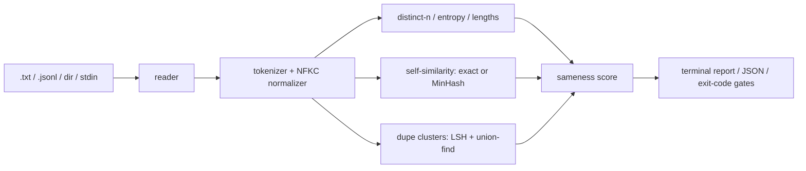

# samey

[English](README.md) | [中文](README.zh.md) | [日本語](README.ja.md)

[](LICENSE) [](CHANGELOG.md) [](pyproject.toml)  [](CONTRIBUTING.md)

**Open-source diversity metrics for generated text — distinct-n, self-similarity, and duplicate clusters folded into one 0-100 sameness score.**


```bash
git clone https://github.com/JaydenCJ/samey && cd samey && pip install -e .
```

> **Pre-release:** samey is not yet published to PyPI. Until the first release, clone [JaydenCJ/samey](https://github.com/JaydenCJ/samey) and run `pip install -e .` from the repository root.

## Why samey?

Synthetic-data generation exploded, and the failure mode nobody budgets for is sameness: the sampler quietly converges, thousands of "new" records are the same template with one slot changed, and you pay per token for data that skews training toward a handful of modes. The tooling around this is either a dedup *pipeline* that rewrites your dataset, a similarity *library* that leaves the metric design to you, or an eval harness that needs a model to judge a model. samey is deliberately smaller: a read-only CLI you point at output files that answers one question — *how same are these?* — with numbers you can gate a pipeline on. It generates nothing, deletes nothing, calls no API, and needs no dependencies.

|  | samey | text-dedup | datasketch | vendi-score |
|---|---|---|---|---|
| One-command diversity report over output files | Yes | No (dedup pipeline) | No (LSH library) | No (Python library) |
| Duplicate clusters reported with record indices | Yes | Removal-oriented | Build it yourself | No |
| Single sameness score with pass/fail gates | Yes | No | No | Score, no CLI or gates |
| Reads plain `.txt` / `.jsonl` from any generator | Yes | Hugging Face datasets-centric | n/a | In-memory arrays |
| Deterministic across runs and machines | Yes | Depends on config | Seed-dependent | Yes |
| Runtime dependencies | 0 | 10+ | 1+ | 2+ |

<sub>Dependency counts are declared runtime requirements on PyPI as of 2026-07: datasketch 1.6.x (numpy), vendi-score 0.0.x (numpy, scipy; torch extras). samey's count is `dependencies = []` in [pyproject.toml](pyproject.toml).</sub>

## Features

- **One number to argue about** — distinct-2, mean pairwise self-similarity, and the duplicate fraction blend into a 0-100 sameness score with honest verdict bands (`diverse` → `collapsed`); the formula is documented, not vibes.
- **Duplicate clusters with receipts** — exact groups (Unicode-normalized) and near-duplicate clusters (shingle Jaccard + union-find) list every record index, so you can trace waste back to the batch that produced it.
- **Catches collapse before it's visible** — `samey ngrams` ranks phrases by how many records share them, surfacing template attractors long before whole outputs duplicate.
- **Gates, not dashboards** — `--max-sameness 40` and `--min-distinct-2 0.5` turn any generation pipeline red with exit code 1 and a `GATE FAIL` line on stderr.
- **Deterministic at any scale** — exact all-pairs Jaccard up to 400 records, then 128-hash MinHash with LSH banding and seeded pair sampling: same corpus in, bit-identical numbers out, on any machine.
- **Zero dependencies, fully offline** — pure standard library, reads local files, sends nothing anywhere; `--json` on every subcommand for scripting.

## Quickstart

Install, then point `score` at a file of generations (one per line, or JSONL with a `--field`):

```bash
samey score examples/collapsed.jsonl --label generations.jsonl
```

```text
samey score — generations.jsonl (12 records)

  sameness   ████████████████░░░░░░░░   66.6 / 100  (mode collapse likely)

  distinct-n            unique / total    ratio
    distinct-1           28 / 147       0.190
    distinct-2           33 / 135       0.244
    distinct-3           34 / 123       0.276

  self-similarity  mean 0.646  max 1.000  (66 pairs, exact)
  duplicates       1 cluster, 7 redundant records (58.3% of corpus)
  entropy          4.12 bits (normalized 0.857)
  compression      81.7% cross-record redundancy
  vocabulary       28 types / 147 tokens  (hapax 57.1%)
```

Gate a pipeline on it (exit code 1 on failure), and find out *what* collapsed:

```bash
samey score generations.jsonl --max-sameness 40   # GATE FAIL: sameness 66.6 exceeds --max-sameness 40.0
samey ngrams generations.jsonl -n 3 --top 3
```

```text
phrase                 records  count
a product description       11     11
here is a                   11     11
is a product                11     11
```

`samey dupes` lists the clusters with previews, and `samey compare old.jsonl new.jsonl` prints a per-metric more-diverse / more-same verdict for two corpora. Runnable corpora live in [`examples/`](examples/).

## Metrics

| Metric | Range | Meaning |
|---|---|---|
| distinct-n | 0–1 | Unique n-grams / total n-grams, pooled across all records (higher = more diverse) |
| self-similarity | 0–1 | Mean pairwise Jaccard over token-bigram sets; exact ≤400 records, MinHash beyond |
| duplicate fraction | 0–1 | Share of records that are redundant copies: Σ(cluster size − 1) / N |
| entropy (normalized) | 0–1 | Flatness of the unigram distribution; near 0 means a few tokens dominate |
| compression redundancy | 0–1 | Cross-record zlib gain; diverse prose floors around 0.3–0.45, read comparatively |
| sameness score | 0–100 | 100 × (0.35·(1−distinct-2) + 0.35·self-similarity + 0.30·duplicate fraction) |

Every formula, edge case, and the band boundaries are specified in [`docs/metrics.md`](docs/metrics.md).

| Key | Default | Effect |
|---|---|---|
| `--format` | `auto` | `lines` (record per line), `jsonl`, `files` (record per file), or auto by extension |
| `--field` | `text` | JSONL key holding the text; dotted paths like `response.content` work |
| `--ngram` | `1,2,3` | Which distinct-n sizes to report (distinct-2 is always computed for the score) |
| `--threshold` | `0.7` | Near-duplicate Jaccard threshold in (0, 1] |
| `--max-sameness` | off | Exit 1 when the sameness score exceeds this value |
| `--min-distinct-2` | off | Exit 1 when distinct-2 falls below this ratio |
| `--json` | off | Machine-readable output on every subcommand |

## Verification

This repository ships no CI; every claim above is verified by local runs. Reproduce them from a checkout of this repository:

```bash
pip install -e '.[dev]' && pytest && bash scripts/smoke.sh
```

Output (copied from a real run, truncated with `...`):

```text
91 passed in 5.54s
...
[dupes] 1 cluster, 7 redundant records
SMOKE OK
```

## Architecture



## Roadmap

- [x] score / dupes / ngrams / compare, MinHash + LSH scale path, pipeline gates, JSON output (v0.1.0)
- [ ] PyPI release with `pip install samey`
- [ ] Configurable score weights and custom verdict bands
- [ ] Per-prompt grouping: diversity measured within samples of the same prompt
- [ ] Pluggable semantic similarity backend (local embeddings, still offline)
- [ ] Self-contained HTML report for sharing a run

See the [open issues](https://github.com/JaydenCJ/samey/issues) for the full list.

## Contributing

Contributions are welcome — start with a [good first issue](https://github.com/JaydenCJ/samey/issues?q=is%3Aissue+is%3Aopen+label%3A%22good+first+issue%22) or open a [discussion](https://github.com/JaydenCJ/samey/discussions). See [CONTRIBUTING.md](CONTRIBUTING.md) for the development setup.

## License

[MIT](LICENSE)
