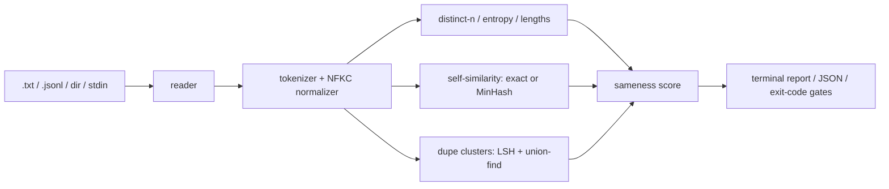

# samey

[English](README.md) | [中文](README.zh.md) | [日本語](README.ja.md)

[](LICENSE) [](CHANGELOG.md) [](pyproject.toml)  [](CONTRIBUTING.md)

**开源的生成文本多样性度量工具 —— 将 distinct-n、自相似度与重复簇折算为一个 0-100 的 sameness（雷同度）分数。**


```bash
git clone https://github.com/JaydenCJ/samey && cd samey && pip install -e .
```

> **预发布：** samey 尚未发布到 PyPI。在首个正式版本之前，请克隆 [JaydenCJ/samey](https://github.com/JaydenCJ/samey) 并在仓库根目录执行 `pip install -e .`。

## 为什么选 samey？

合成数据生成规模爆发，而没人预算的失败模式是"雷同"：采样器悄悄收敛，成千上万条"新"记录只是同一模板换了一个槽位，你按 token 付费买来的数据却把训练拉向少数几个模式。现有工具要么是会改写数据集的去重*流水线*，要么是把指标设计留给你的相似度*库*，要么是需要用一个模型去评判另一个模型的评测框架。samey 刻意做得更小：一个只读的 CLI，指向输出文件，回答一个问题——*这些输出有多雷同？*——并给出可以直接作为流水线门禁的数字。它不生成、不删除、不调用任何 API，也没有任何依赖。

|  | samey | text-dedup | datasketch | vendi-score |
|---|---|---|---|---|
| 一条命令得到输出文件的多样性报告 | 是 | 否（去重流水线） | 否（LSH 库） | 否（Python 库） |
| 报告带记录索引的重复簇 | 是 | 面向删除 | 需自行搭建 | 否 |
| 单一 sameness 分数 + 通过/失败门禁 | 是 | 否 | 否 | 仅分数，无 CLI 和门禁 |
| 直接读取任意生成器的 `.txt` / `.jsonl` | 是 | 以 Hugging Face datasets 为中心 | 不适用 | 内存数组 |
| 跨运行、跨机器结果确定 | 是 | 取决于配置 | 依赖种子 | 是 |
| 运行时依赖 | 0 | 10+ | 1+ | 2+ |

<sub>依赖数为 PyPI 上声明的运行时依赖，统计于 2026-07：datasketch 1.6.x（numpy）、vendi-score 0.0.x（numpy、scipy；torch 为 extras）。samey 的依赖数即 [pyproject.toml](pyproject.toml) 中的 `dependencies = []`。</sub>

## 特性

- **一个可以拿来吵架的数字** —— distinct-2、平均成对自相似度和重复占比加权合成 0-100 的 sameness 分数，并给出诚实的判定档位（`diverse` → `collapsed`）；公式有文档可查，不靠感觉。
- **有凭有据的重复簇** —— 精确重复组（Unicode 归一化）与近重复簇（shingle Jaccard + 并查集）列出每条记录的索引，浪费可以追溯到产生它的那一批。
- **在肉眼可见之前抓住坍缩** —— `samey ngrams` 按短语覆盖的记录数排序，在整条输出重复之前就把模板吸引子暴露出来。
- **是门禁，不是仪表盘** —— `--max-sameness 40` 与 `--min-distinct-2 0.5` 让任何生成流水线以退出码 1 变红，并在 stderr 打印 `GATE FAIL` 行。
- **任意规模下都确定** —— 400 条以内做精确全对 Jaccard，之后切换到 128 哈希 MinHash + LSH 分带与定种子抽样：同样的语料进，任何机器上都得到逐位一致的数字。
- **零依赖、完全离线** —— 纯标准库，只读本地文件，不向任何地方发送数据；每个子命令都支持 `--json` 以便脚本化。

## 快速上手

安装后，把 `score` 指向一个生成结果文件（每行一条，或配合 `--field` 的 JSONL）：

```bash
samey score examples/collapsed.jsonl --label generations.jsonl
```

```text
samey score — generations.jsonl (12 records)

  sameness   ████████████████░░░░░░░░   66.6 / 100  (mode collapse likely)

  distinct-n            unique / total    ratio
    distinct-1           28 / 147       0.190
    distinct-2           33 / 135       0.244
    distinct-3           34 / 123       0.276

  self-similarity  mean 0.646  max 1.000  (66 pairs, exact)
  duplicates       1 cluster, 7 redundant records (58.3% of corpus)
  entropy          4.12 bits (normalized 0.857)
  compression      81.7% cross-record redundancy
  vocabulary       28 types / 147 tokens  (hapax 57.1%)
```

用它给流水线设门禁（失败时退出码为 1），再查明*什么*坍缩了：

```bash
samey score generations.jsonl --max-sameness 40   # GATE FAIL: sameness 66.6 exceeds --max-sameness 40.0
samey ngrams generations.jsonl -n 3 --top 3
```

```text
phrase                 records  count
a product description       11     11
here is a                   11     11
is a product                11     11
```

`samey dupes` 会列出带预览的重复簇，`samey compare old.jsonl new.jsonl` 会对两个语料逐指标打印 more-diverse / more-same 判定。可运行的示例语料见 [`examples/`](examples/)。

## 指标

| 指标 | 范围 | 含义 |
|---|---|---|
| distinct-n | 0–1 | 全部记录合并后：唯一 n-gram / 总 n-gram（越高越多样） |
| self-similarity | 0–1 | 词二元组集合上的平均成对 Jaccard；≤400 条精确计算，之后用 MinHash |
| duplicate fraction | 0–1 | 冗余副本占比：Σ(簇大小 − 1) / N |
| entropy (normalized) | 0–1 | 一元分布的平坦度；接近 0 表示少数 token 占主导 |
| compression redundancy | 0–1 | 跨记录 zlib 增益；多样的文本底线约在 0.3–0.45，应做相对解读 |
| sameness score | 0–100 | 100 × (0.35·(1−distinct-2) + 0.35·self-similarity + 0.30·duplicate fraction) |

每个公式、边界情况与档位边界都写明在 [`docs/metrics.md`](docs/metrics.md) 中。

| 键 | 默认值 | 作用 |
|---|---|---|
| `--format` | `auto` | `lines`（每行一条）、`jsonl`、`files`（每文件一条），或按扩展名自动判断 |
| `--field` | `text` | JSONL 中存放文本的键；支持 `response.content` 这样的点路径 |
| `--ngram` | `1,2,3` | 要报告的 distinct-n 尺寸（分数所需的 distinct-2 总会计算） |
| `--threshold` | `0.7` | 近重复的 Jaccard 阈值，取值 (0, 1] |
| `--max-sameness` | 关 | sameness 分数超过该值时以退出码 1 结束 |
| `--min-distinct-2` | 关 | distinct-2 低于该比值时以退出码 1 结束 |
| `--json` | 关 | 每个子命令输出机器可读结果 |

## 验证

本仓库不附带 CI；上述所有断言均由本地运行验证。可从本仓库的检出中复现：

```bash
pip install -e '.[dev]' && pytest && bash scripts/smoke.sh
```

输出（摘自真实运行，用 `...` 截断）：

```text
91 passed in 5.54s
...
[dupes] 1 cluster, 7 redundant records
SMOKE OK
```

## 架构



## 路线图

- [x] score / dupes / ngrams / compare、MinHash + LSH 扩展路径、流水线门禁、JSON 输出（v0.1.0）
- [ ] 发布到 PyPI，支持 `pip install samey`
- [ ] 可配置的分数权重与自定义判定档位
- [ ] 按 prompt 分组：在同一 prompt 的多个样本内部度量多样性
- [ ] 可插拔的语义相似度后端（本地 embedding，仍然离线）
- [ ] 可分享的自包含 HTML 报告

完整列表见 [open issues](https://github.com/JaydenCJ/samey/issues)。

## 贡献

欢迎贡献 —— 可以从 [good first issue](https://github.com/JaydenCJ/samey/issues?q=is%3Aissue+is%3Aopen+label%3A%22good+first+issue%22) 入手，或发起一个 [discussion](https://github.com/JaydenCJ/samey/discussions)。开发环境搭建见 [CONTRIBUTING.md](CONTRIBUTING.md)。

## 许可证

[MIT](LICENSE)
